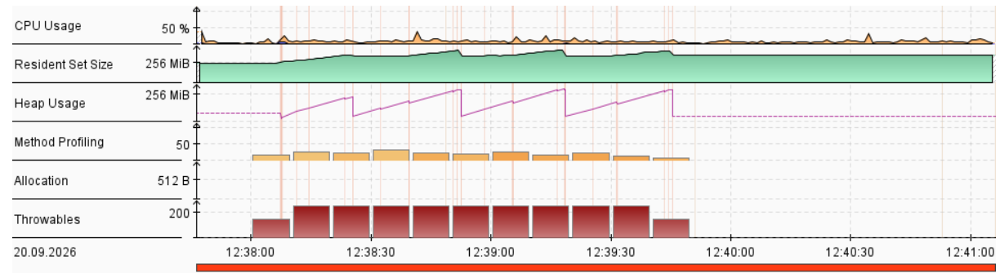
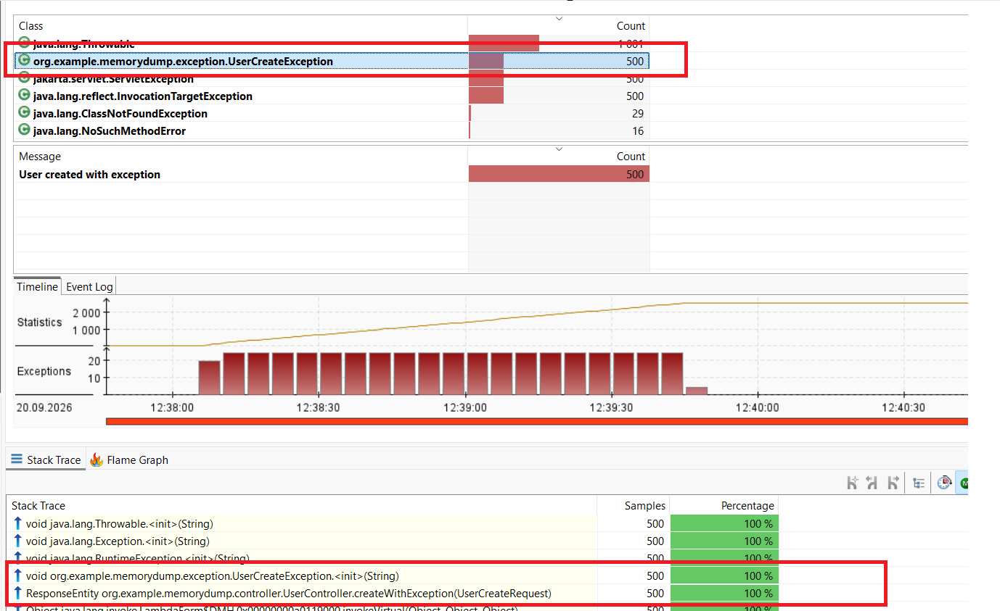
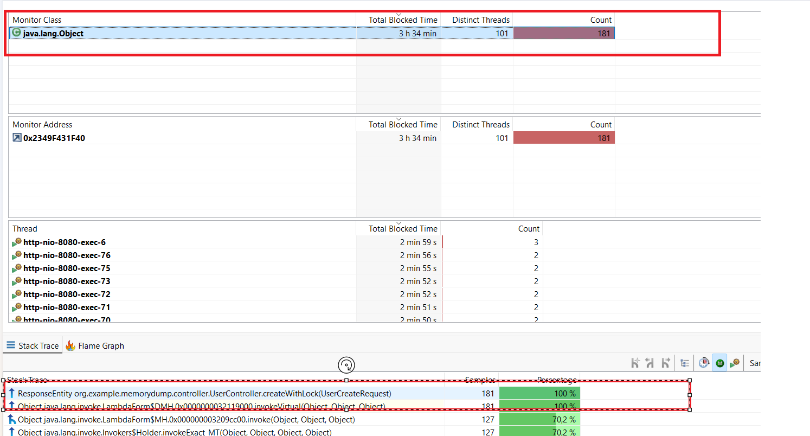
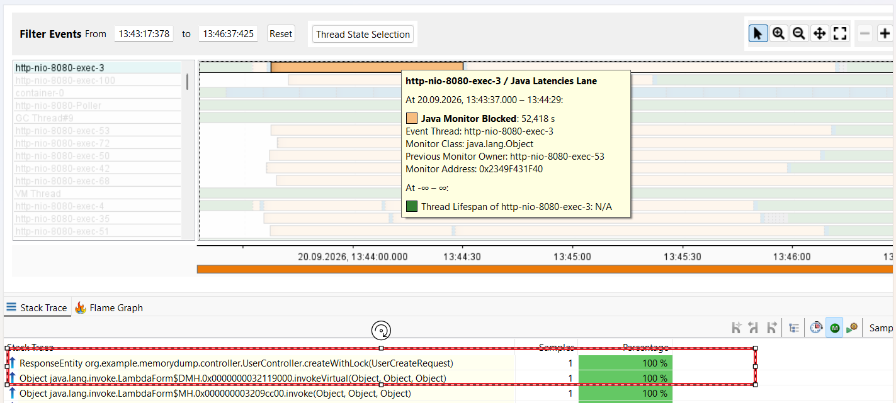
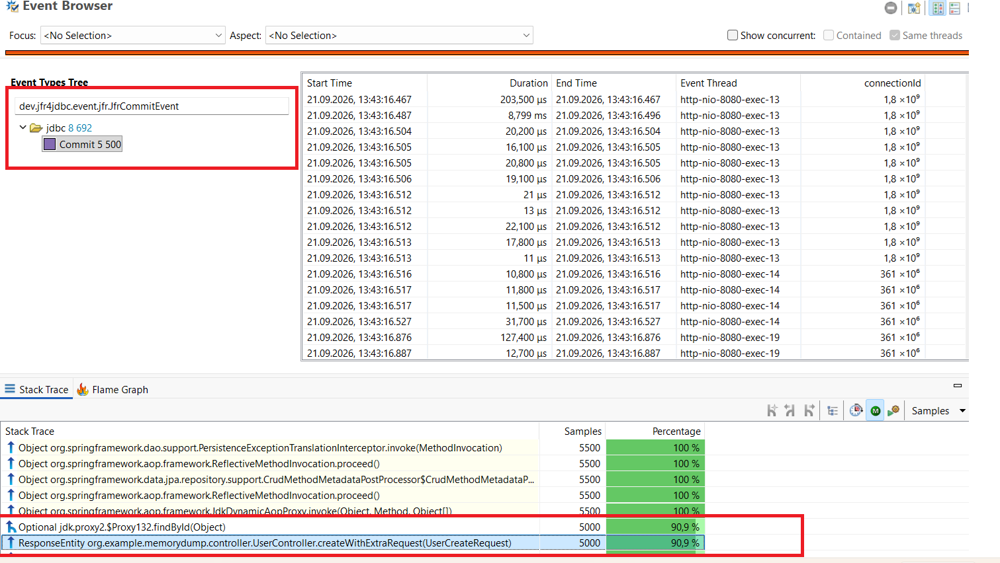

# Анализ профилирования с помощью jfr

## Предусловие: сохраним baseline работы приложения без проблемных кейсов
1. запустить приложение aivazian/memory-dump
2. запустить команду jcmd. Найти и сохранить PID процесса
3. запустить запись профилирования через jfr.
   jcmd <PID> JFR.start name=baseline duration=200s settings=profile filename=<PATH>
   Например jcmd 19364 JFR.start name=baseline duration=200s settings=profile filename=C:\Users\Selecty\IdeaProjects\Java-Advanced-2026-06\aivazian\jfr\baseline.jfr
4. запустить нагрузочный тест успешного сценария создания пользователя. Смотри файл CreatUsersThreadGroup.jmx
5. вывести summary через команду jfr summary baseline.jfr
   Смотри файл baseline-summary.txt
6. Импорт результатов в jmc

## Проблемный кейс: лишние исключения
### Предусловие:
1. запустить приложение aivazian/memory-dump
2. запустить запись профилирования через jfr.
   jcmd <PID> JFR.start name=baseline duration=200s settings=profile filename=<PATH>
   Например jcmd 16856 JFR.start name=exception duration=160s settings=profile filename=C:\Users\Selecty\IdeaProjects\Java-Advanced-2026-06\aivazian\jfr\exception.jfr
3. запустить нагрузочный тест эндпоинта, который иммитирует ненужные исключения api/users/exception. Смотри файл ExceptionThreadGroup.jmx
4. вывести summary через команду jfr summary exception.jfr
   Смотри файл exception-summary.txt
5. Импорт результатов в jmc

### Анализ
1. анализ summary показал, что при одинаковой нагрузке exception case сценарий имеет в 10 раз больше событий jdk.JavaExceptionThrow
-- baseline case ->   jdk.JavaExceptionThrow                    195          4623
-- exception case ->  jdk.JavaExceptionThrow                   2573         48985
2. При анализе exception.jfr в jmc выявлен рост ошибок во время нагрузки, перед и после нагрузки количество исключений резко падает

Анализ вкладки Exceptions показал, что большое количество org.example.memorydump.exception.UserCreateException	возникло во время нагрузки.
По стейктрейсу видно откуда идет это исключение 
Stack Trace	Count	Percentage
ResponseEntity org.example.memorydump.controller.UserController.createWithException(UserCreateRequest)	500	100 %

## Проблемный кейс: лишние блокировки
### Предусловие:
1. запустить приложение aivazian/memory-dump
2. запустить запись профилирования через jfr.
   jcmd <PID> JFR.start name=baseline duration=200s settings=profile filename=<PATH>
   Например jcmd 16856 JFR.start name=lock duration=160s settings=profile filename=C:\Users\Selecty\IdeaProjects\Java-Advanced-2026-06\aivazian\jfr\lock.jfr
3. запустить нагрузочный тест эндпоинта, который иммитирует ненужные исключения api/users/lock. Смотри файл LockThreadGroup.jmx.jmx
4. вывести summary через команду jfr summary lock.jfr
   Смотри файл baseline-summary.txt
5. Импорт результатов в jmc

### Анализ
1. анализ summary показал, что при одинаковой нагрузке lock case сценарий имеет практически в разы больше событий jdk.JavaMonitorEnter
   -- baseline case ->   jdk.JavaMonitorEnter                        1            22
   -- lock case ->       jdk.JavaMonitorEnter                      181          4387
2. При анализе блокировок lock.jfr в jmc выявлен что 100% блокировок было в org.example.memorydump.controller.UserController.createWithLock

3. При анализе потоков во вкладке Threads также обнаружены красные зоны указывающие на org.example.memorydump.controller.UserController.createWithLock

Таким образом мы видим, что во время нагрузки потоки простаивают в org.example.memorydump.controller.UserController.createWithLock из-за блокировки,
до и после нагрузки потоки отображаются зеленным, что говорит об отсуствии блокировок

## Проблемный кейс: лишние запросы в БД
### Предусловие:
1. Для измерения кастомных событий была добавлена зависимость jfr4jdbc-driver
2. запустить приложение aivazian/memory-dump
3. запустить запись профилирования через jfr.
   jcmd <PID> JFR.start name=baseline duration=200s settings=profile filename=<PATH>
   Например jcmd 16856 JFR.start name=extra duration=160s settings=profile filename=C:\Users\Selecty\IdeaProjects\Java-Advanced-2026-06\aivazian\jfr\extra.jfr
4. запустить нагрузочный тест эндпоинта, который иммитирует ненужные исключения api/users/extra. Смотри файл ExtraThreadGroup.jmx.jmx
5. вывести summary через команду jfr summary extra.jfr
   Смотри файл baseline-summary2.txt
6. Импорт результатов в jmc

### Анализ
1. анализ summary показал, что при одинаковой нагрузке extra sql case сценарий имеет практически в разы больше событий dev.jfr4jdbc.event.jfr.JfrCommitEvent
   -- baseline case ->        dev.jfr4jdbc.event.jfr.JfrCommitEvent                   500          9521
   -- extra sql case ->       dev.jfr4jdbc.event.jfr.JfrCommitEvent                  5500         99457
2. При анализе блокировок extra.jfr в jmc выявлен что 90% событий исходят из org.example.memorydump.controller.UserController.createWithExtraRequest

