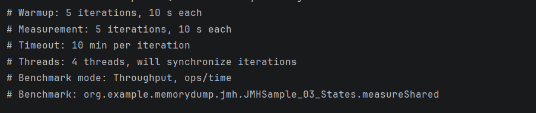
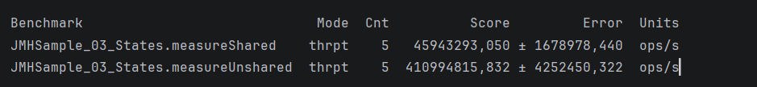
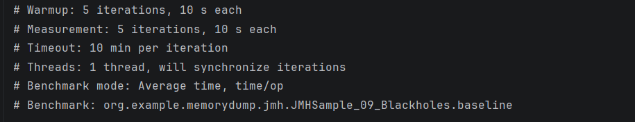
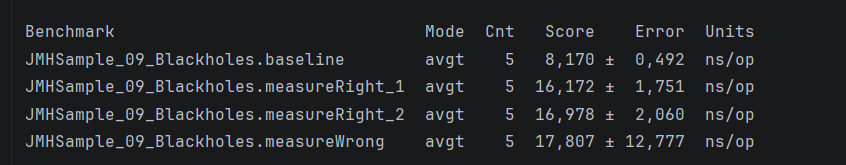
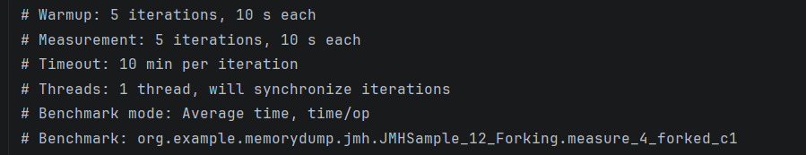
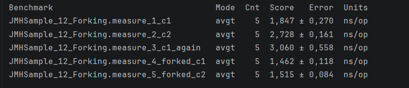

# Запуск примеров тестов jmh

## 1.JMHSample_03_States
ссылка https://hg.openjdk.org/code-tools/jmh/file/2be2df7dbaf8/jmh-samples/src/main/java/org/openjdk/jmh/samples/JMHSample_03_States.java

### Параметры запуска

### Результаты

Так как тест проводится с использованием 4 потоков, мы видим, что Scope.Thread работает медленнее, чем Scope.Benchmark. 
Т.к. для каждого потока создается свой инстанс данных, в отличие от Scope.Benchmark

## 2.JMHSample_09_Blackholes 
https://hg.openjdk.org/code-tools/jmh/file/2be2df7dbaf8/jmh-samples/src/main/java/org/openjdk/jmh/samples/JMHSample_09_Blackholes.java
### Параметры запуска

### Результаты

Видим что JMHSample_09_Blackholes.measureWrong крайне не стабилен, показатель погрешности 12,777. 
Нестабильность теста связана с тем, что компилятор может оптимизировать строку Math.log(x1);

## 3.JMHSample_09_Blackholes 
https://hg.openjdk.org/code-tools/jmh/file/2be2df7dbaf8/jmh-samples/src/main/java/org/openjdk/jmh/samples/JMHSample_12_Forking.java
### Параметры запуска

### Результаты

По результатам видно как первые три теста постепенно замедлятся. 
Без Fork JIT "загрязняет" оптимизации между разными benchmark'ами
При добавлении Fork(1) каждый счетчик работает в "чистом" jvm. оптимизация максимальная
