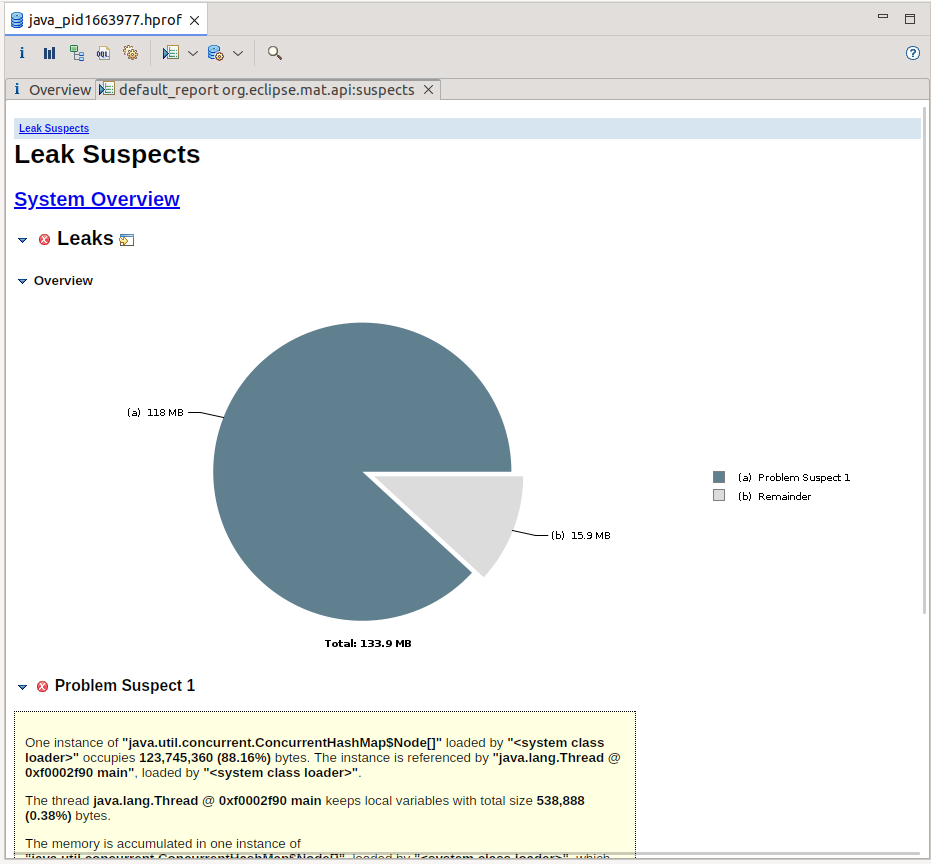
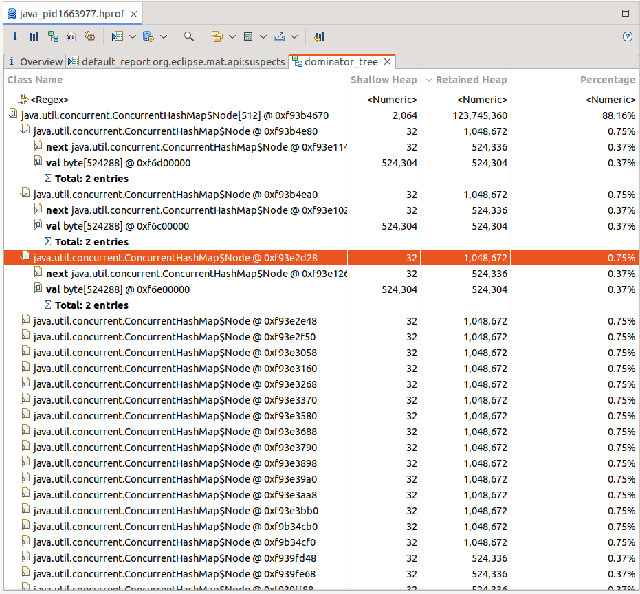
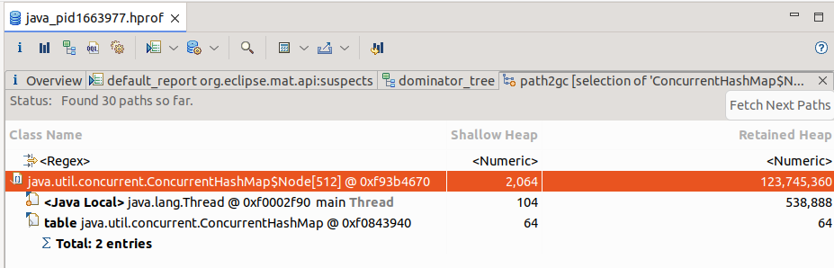

# hw-05-memory-leak

Сервис регистрации пользователей (spring boot, rest + h2 + spring data jpa) с заложенной утечкой памяти: падает с OutOfMemoryError. Задание - сделать дамп хипа, найти утечку в Eclipse MAT и починить.

## Шаг 1 - приложение

Сервис регистрации пользователя в системе:
- Application (запуск + нагрузка - цикл в CommandLineRunner сам регистрирует пользователей каждые 600 мс)
- RegistrationController (POST /register?login=...&password=...)
- RegistrationService (сохраняет пользователя и кладёт его "профиль" в кэш)
- User + UserRepository - сущность и jpa-репозиторий

## Шаг 2 - заложенная утечка

Утечка - в RegistrationService: при каждой регистрации кэш забивается на
полмегабайта. Ключи уникальные, ничего не вытесняется - мапа растёт всю жизнь приложения

```java
private final Map<String, byte[]> profileCache = new ConcurrentHashMap<>();

public long register(String login, String password) {
    profileCache.put(login, new byte[512 * 1024]);
    return users.save(new User(login, password)).getId();
}
```

## Шаг 3 - запуск с дампом хипа

Сборка и запуск:

```
mvn clean package
java -Xms256m -Xmx256m -XX:+HeapDumpOnOutOfMemoryError -XX:HeapDumpPath=. -XX:+ExitOnOutOfMemoryError -jar target/hw-05-memory-leak-1.0-SNAPSHOT.jar
```

Через пару минут приложение падает:

```
java.lang.OutOfMemoryError: Java heap space
Dumping heap to ./java_pid1663977.hprof ...
Heap dump file created [291805389 bytes in 0,553 secs]
```

## Шаг 4 - анализ дампа в MAT

### Leak Suspects



Подозреваемый один: `ConcurrentHashMap$Node[]` - 123 745 360 байт, 88,16%
хипа.

### Dominator Tree



Раскрываю подозреваемого: внутри таблицы Node[512] - записи ConcurrentHashMap,
в каждой `val byte[524288]` - полмегабайта, те самые, что я кладу в кэш при
каждой регистрации.

### Path to GC Roots



Цепочка до GC-корня: `Node[512]` - таблица мапы `ConcurrentHashMap`, мапа -
поле `profileCache` в `RegistrationService`, бин живёт в спринге - пока он
жив, GC до этих байтов не доберётся.

## Вывод

Утечка - RegistrationService, строки 12 и 21: безразмерный кэш `profileCache`,
куда каждая регистрация навсегда кладёт `byte[512 * 1024]`. Около 240
регистраций по 0,5 мб - вот и OOM.
