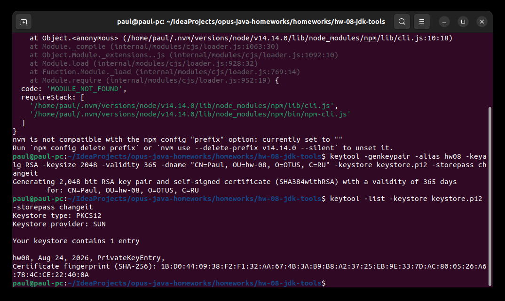
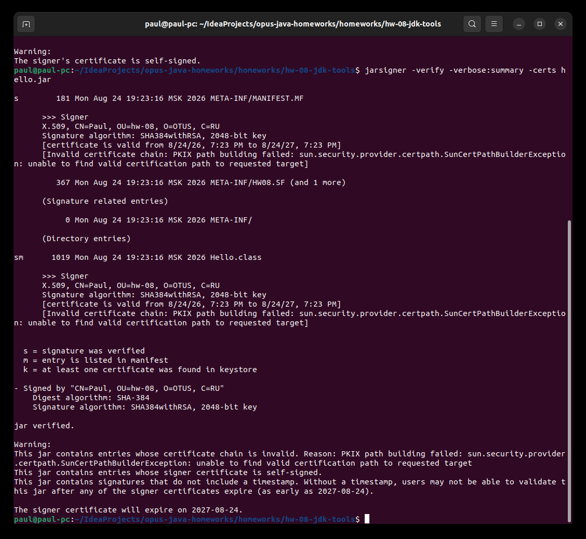
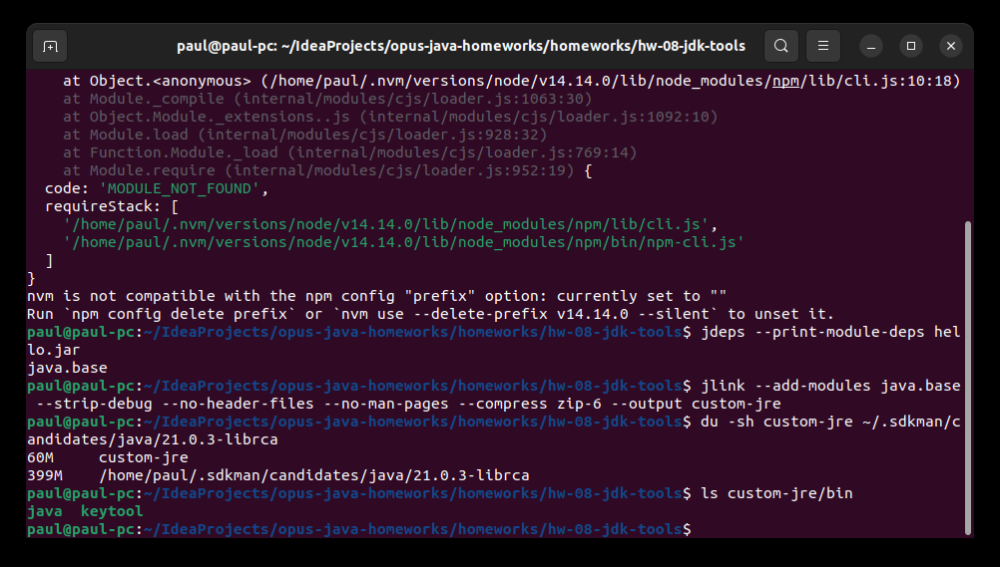
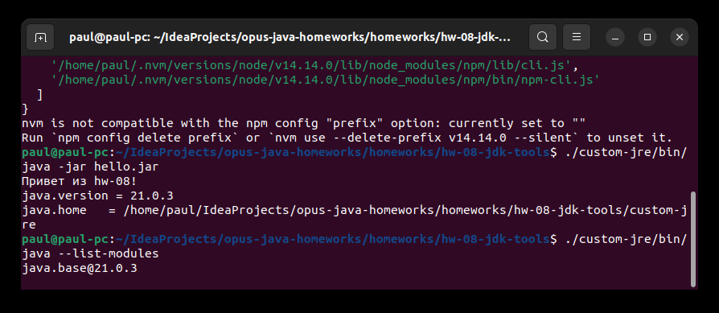

# hw-08-jdk-tools

Задание - поработать с инструментами JDK: выпустить самоподписанный сертификат
через keytool, подписать им jar и верифицировать подпись (jarsigner), потом
собрать jlink'ом облегчённую jre и запустить на ней свою программу.

Без maven - задание само про инструменты jdk, собирал всё руками.

## Класс и jar

Hello.java - один класс с методом main, печатает версию и java.home (по
java.home ниже будет видно, на какой jre реально стартует программа):

```
javac Hello.java
jar cfe hello.jar Hello Hello.class
java -jar hello.jar
```

## Шаг 1 - самоподписанный сертификат

Выпускаю сертификат (RSA 2048, на год) в keystore:

```
keytool -genkeypair -alias hw08 -keyalg RSA -keysize 2048 -validity 365 \
  -dname "CN=Paul, OU=hw-08, O=OTUS, C=RU" -keystore keystore.p12 -storepass changeit
```



В `keytool -list` виден PrivateKeyEntry - в хранилище приватный ключ вместе с
сертификатом.

## Шаг 2 - подпись jar и верификация

До подписи:

```
jarsigner -verify hello.jar
jar is unsigned.
```

Подписываю и проверяю:

```
jarsigner -keystore keystore.p12 -storepass changeit hello.jar hw08
jar signed.

jarsigner -verify -verbose:summary -certs hello.jar
...
sm      1019 ... Hello.class
...
jar verified.
```



`sm` у Hello.class: s - подпись проверена, m - файл перечислен в манифесте.
Сертификат из jar можно посмотреть и keytool'ом (`keytool -printcert -jarfile
hello.jar`) - там Owner и Issuer одинаковые, потому что сертификат
самоподписанный.

Warnings про self-signed и отсутствие timestamp ожидаемые: сертификат не от
центра сертификации, на верификацию это не влияет.

## Шаг 3 - custom jre через jlink

Какие модули нужны jar'у:

```
jdeps --print-module-deps hello.jar
java.base
```

Только java.base. Собираю рантайм:

```
jlink --add-modules java.base --strip-debug --no-header-files --no-man-pages \
  --compress zip-6 --output custom-jre
```



Собралось за 4 секунды, 60 МБ против 399 МБ у полного JDK. В custom-jre/bin
только java и keytool - ни компилятора, ни jarsigner, рантайм чисто для запуска.

## Шаг 4 - запуск на custom jre



```
./custom-jre/bin/java -jar hello.jar
Привет из hw-08!
java.version = 21.0.3
java.home   = .../hw-08-jdk-tools/custom-jre
```

java.home указывает внутрь custom-jre - программа реально работает на
собранной jre, полный JDK для запуска не нужен.

Что лежит внутри собранной рантаймы:

```
./custom-jre/bin/java --list-modules
java.base@21.0.3
```

Один модуль вместо ~70 у полного JDK. Сам custom-jre в git не кладу (тяжёлый
и пересобирается одной командой выше), добавил в .gitignore.
