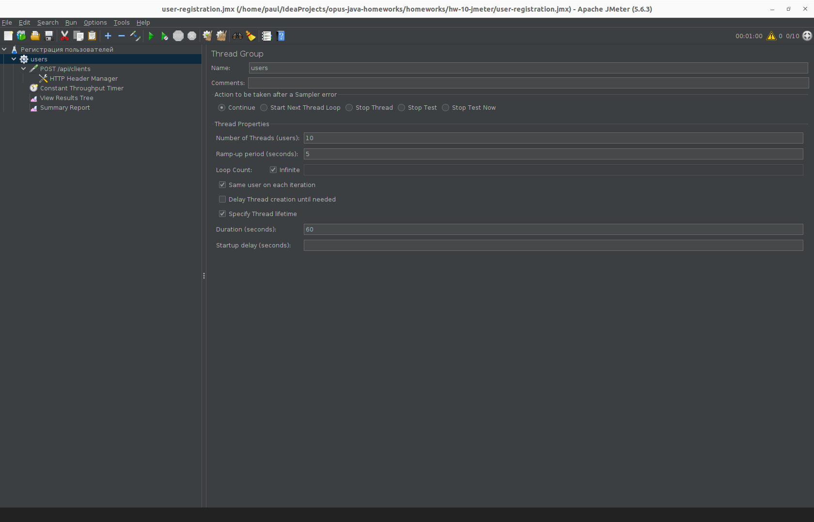
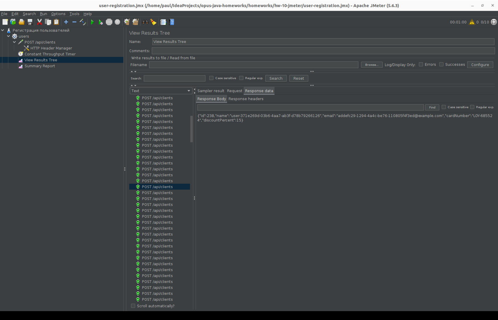
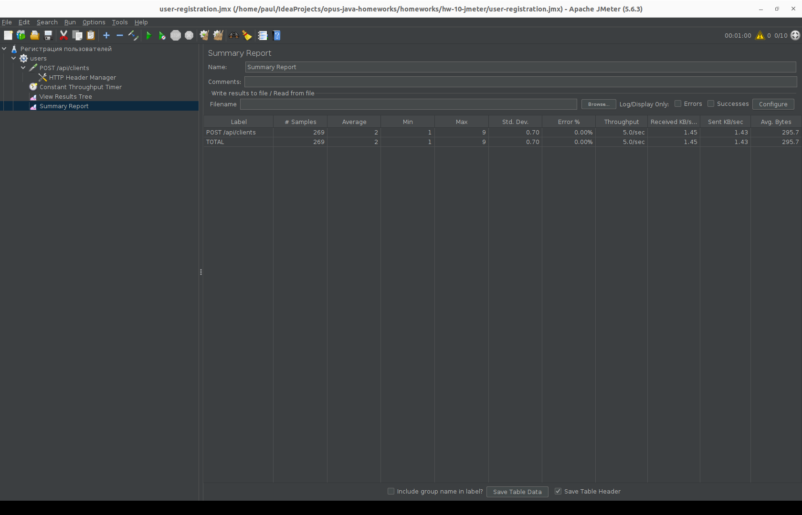

# hw-10-jmeter

Генератор нагрузки на JMeter. Нагружаем сервис регистрации из hw-07
(`POST /api/clients`, принимает `{"name": "...", "email": "..."}`, отвечает 201).

Перед прогонами поднять сервис:

```bash
cd ../hw-07-java-modules
mvn clean package
mkdir -p mods && cp */target/*.jar mods/
java -p mods -m hw07.api
```

## Пункт 1 - план через UI JMeter

`user-registration.jmx` - собран в UI JMeter 5.6.3:

- Thread Group: 10 потоков, ramp-up 5 сек, длительность 60 сек
- HTTP Request: POST localhost:8080/api/clients, в теле `${__UUID}` + header Content-Type: application/json
- Constant Throughput Timer: 300 запросов в минуту = 5 RPS (регулируется этим полем)

План:



Прогон из UI (Ctrl+R): ответ 201 с созданным клиентом:



Итог: 269 запросов, 5.0/sec, 0% ошибок.



## Пункт 2 - подмодуль load-generator (ApacheJMeter_core)

Тот же план собран кодом, без UI: `load-generator/src/main/java/hw10/LoadGenerator.java`.
Каждый элемент плана из UI - это класс (ThreadGroup, HTTPSamplerProxy,
ConstantThroughputTimer...), дерево плана - HashTree.

```bash
mvn clean package
export JMETER_HOME=~/tools/apache-jmeter-5.6.3
java -Drps=10 -Dthreads=5 -Dduration=30 -jar load-generator/target/load-generator.jar
```

При старте jar сразу начинает гнать нагрузку на localhost:8080.
Если запустить без -D-аргументов, сработают дефолты: threads=10, ramp=5, duration=60 сек, rps=5, host=localhost, port=8080.

Вывод в консоль в конце прогона:

```
summary =    304 in 00:00:30 =   10.1/s Avg:     2 Min:     1 Max:    36 Err:     0 (0.00%)
```

Логи и выборка запуска jar'а - в `logs/` (`load-generator.log`, `results.jtl`).

Проверка, что регистрации дошли: `curl localhost:8080/api/clients`
